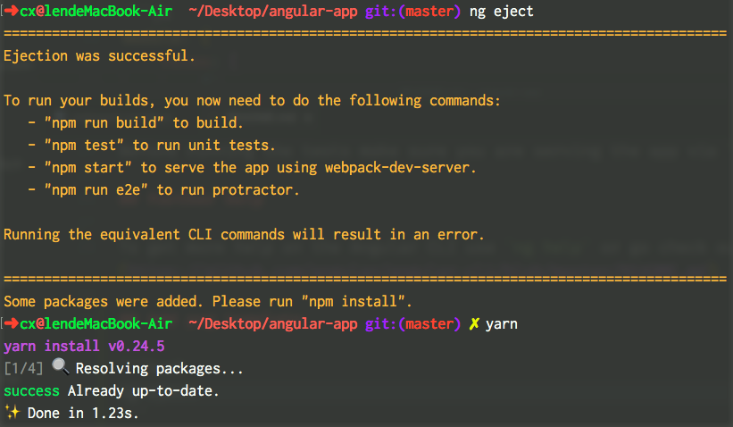
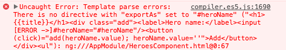

# AngularApp

This project was generated with [Angular CLI](https://github.com/angular/angular-cli) version 1.3.0.

## Development server

Run `ng serve` for a dev server. Navigate to `http://localhost:4200/`. The app will automatically reload if you change any of the source files.

## Code scaffolding

Run `ng generate component component-name` to generate a new component. You can also use `ng generate directive|pipe|service|class|guard|interface|enum|module`.

## Build

Run `ng build` to build the project. The build artifacts will be stored in the `dist/` directory. Use the `-prod` flag for a production build.

## Running unit tests

Run `ng test` to execute the unit tests via [Karma](https://karma-runner.github.io).

## Running end-to-end tests

Run `ng e2e` to execute the end-to-end tests via [Protractor](http://www.protractortest.org/).
Before running the tests make sure you are serving the app via `ng serve`.

## Further help

To get more help on the Angular CLI use `ng help` or go check out the [Angular CLI README](https://github.com/angular/angular-cli/blob/master/README.md).

---
---

## Add Command

```bash
# clear build file
yarn clear

# uglify js
yarn build:prod
```

## Add pug template

### Step

> Step 1

```bash
ng eject

yarn

yarn add pug-html-loader --dev
```



> Step 2

```js
// edit webpack.config.js
"modules": {
    "rules": [
        {
            "test": /\.pug$/,
            "use": ["raw-loader", "pug-html-loader"]
        }
    ]
}
```

### Pug template compilation error

> angular template reference variables

```pug
//- error
input(#heroName)
//- ok
<input #heroName>
//- ok
<input ref-heroName>
```



#### [Solutions: stackoverflow](https://stackoverflow.com/q/45687501/7324114?stw=2)

> [pug doc (attributes)](https://pugjs.org/language/attributes.html)

>> 当遇到解决不了的问题时，换个思路也许就好了，我之前一直想着从`pug`变量入手，但现在看来应该是属性或解析规则的问题。

- add doctype html to the header of the file.

```pug
doctype html
input(#heroName)
```

- use pug `&attributes` syntax can be used to explode an object into attributes of an element.

```pug
input&attributes({'#heroName': ''})
```

- edit `webpack.config.js` file.

```js
"modules": {
    "rules": [
        {
        "test": /\.pug$/,
        "use": [
          'raw-loader',
          {
            "loader": 'pug-html-loader',
            "options": {
              "doctype": 'html'
            }
          }
        ]
      }
    ]
}
```

## [More ...](./HERO.DOC.md)